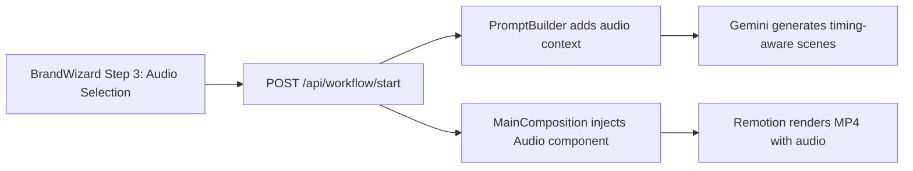

# Add Audio Support to Generated Videos

## Approach

The audio feature has two layers:

1. **Deterministic layer** -- The `MainComposition` generator always injects the selected background track as a looping `<Audio>` component with fade-in/fade-out. This guarantees every video has music regardless of what the AI does.
2. **AI-aware layer** -- The prompt builder tells Gemini about the selected track (name, mood, energy, BPM). The AI can then: time animations to match the audio energy, add dramatic pauses, or request per-scene sound effects. The `audio.md` skill is already in the skills router and will be auto-selected when audio context is present.




## Files to Change

### 1. Audio catalog -- new file `lib/audioLibrary.ts`

Define the curated track catalog. Each track has metadata the AI can reason about:

```typescript
export interface AudioTrack {
  id: string;
  name: string;
  filename: string;        // e.g. "upbeat-corporate.mp3"
  mood: string;            // e.g. "upbeat", "cinematic", "chill"
  energy: 'high' | 'medium' | 'low';
  bpm?: number;
  durationSeconds: number;
  genre: string;           // e.g. "electronic", "orchestral", "ambient"
  description: string;     // Human-readable, also fed to AI
}

export const AUDIO_LIBRARY: AudioTrack[] = [
  { id: 'upbeat-corporate', name: 'Momentum', filename: 'upbeat-corporate.mp3', mood: 'upbeat', energy: 'high', bpm: 120, ... },
  { id: 'cinematic-epic', name: 'Horizon', filename: 'cinematic-epic.mp3', mood: 'cinematic', energy: 'medium', bpm: 90, ... },
  { id: 'ambient-chill', name: 'Drift', filename: 'ambient-chill.mp3', mood: 'chill', energy: 'low', bpm: 80, ... },
  { id: 'none', name: 'No Audio', filename: '', mood: 'none', energy: 'low', ... },
];
```

We will source 3-5 short royalty-free tracks (CC0/public domain) and place them in `remotion/public/audio/`. Tracks should be ~~60s loops, trimmed and compressed to keep the repo small (~~500KB-1MB each as MP3).

### 2. Types -- [types.ts](types.ts)

Add `AudioConfig` to the data model:

```typescript
export interface AudioConfig {
  trackId: string;          // ID from the audio library
  trackName: string;        // Display name
  filename: string;         // File in remotion/public/audio/
  mood: string;
  energy: 'high' | 'medium' | 'low';
  bpm?: number;
  volume: number;           // 0.0 - 1.0, default 0.5
}
```

Add `audio?: AudioConfig` to `VideoConfig` (optional for backward compatibility).

### 3. BrandWizard -- [components/BrandWizard.tsx](components/BrandWizard.tsx)

Add audio selection to the existing **Step 3 (Motion DNA)**. This is the natural home since it already handles style, aspect ratio, and resolution. Changes:

- Import `AUDIO_LIBRARY` and render a track selector grid (cards with track name, mood badge, energy indicator)
- Add a volume slider (default 0.5)
- Include a "No Audio" option
- Optional: add a small preview play button per track (using an HTML `<audio>` element for instant browser preview)
- Store selected track in `config.audio`

### 4. API flow -- [server/api/routes/workflow.routes.ts](server/api/routes/workflow.routes.ts)

No structural changes needed. The `audio` field travels inside `config` from `req.body` through `orchestrator.start()` into the workflow state, where it is already accessible as `state.config.audio`.

### 5. Prompt builder -- [server/core/agent/promptBuilder.ts](server/core/agent/promptBuilder.ts)

In the `buildPrompt()` function, add an audio context section when `config.audio` is present:

```
## Audio Context
A background music track has been selected for this video:
- Track: "${track.trackName}" (${track.mood}, ${track.energy} energy, ${track.bpm} BPM)
- The track loops for the full video duration.
- Consider timing key visual moments (reveals, transitions, text entries) to align
  with the audio energy level. ${track.energy === 'high' ? 'Use snappy, rhythmic animations.' : 
  track.energy === 'low' ? 'Use slow, smooth transitions.' : 'Use balanced pacing.'}
- You may add per-scene <Audio> components for sound effects using staticFile() 
  from the "remotion/public/audio/" directory, but the background track is handled 
  automatically -- do NOT add the background track in your scene code.
```

This also ensures the `audio` skill keyword is present, so the skills router will automatically include `audio.md` in the prompt context.

### 6. MainComposition generation -- [server/core/workflow/phases/ImplementationPhase.ts](server/core/workflow/phases/ImplementationPhase.ts)

Modify `generateMainComposition()` (line ~957) to inject an `<Audio>` component when audio is configured:

```typescript
// Inside generateMainComposition():
const audioConfig = state.config.audio;
const hasAudio = audioConfig && audioConfig.trackId !== 'none' && audioConfig.filename;

const audioImport = hasAudio
  ? `import { Audio } from '@remotion/media';\nimport { staticFile, useVideoConfig } from 'remotion';`
  : '';

const audioComponent = hasAudio
  ? `      {/* Background audio track */}
      <Audio
        src={staticFile('audio/${audioConfig.filename}')}
        volume={${audioConfig.volume ?? 0.5}}
        loop
      />`
  : '';
```

The generated `MainComposition.tsx` becomes:

```tsx
import React from 'react';
import { AbsoluteFill, Series } from 'remotion';
import { Audio } from '@remotion/media';
import { staticFile } from 'remotion';
// ... scene imports ...

export const MainComposition: React.FC = () => {
  return (
    <AbsoluteFill>
      {/* Background audio */}
      <Audio src={staticFile('audio/upbeat-corporate.mp3')} volume={0.5} loop />
      <Series>
        {/* ... scenes ... */}
      </Series>
    </AbsoluteFill>
  );
};
```

### 7. Audio assets -- `remotion/public/audio/`

Create this directory and populate it with 3-5 royalty-free tracks. Sources for CC0 music:

- Pixabay Music (free, no attribution required)
- Freesound.org (CC0 section)
- Mixkit (free license)

Recommended starter tracks:

- `upbeat-corporate.mp3` -- energetic, modern (good for tech/startup)
- `cinematic-epic.mp3` -- dramatic, orchestral (good for cinematic style)
- `ambient-chill.mp3` -- calm, atmospheric (good for minimalist/fluid styles)
- `bold-electronic.mp3` -- punchy, rhythmic (good for geometric/brutalist styles)

### 8. Remotion dependency check

The `@remotion/media` package is already listed in `index.json` as an available package, and the `audio.md` skill file already documents its API. Verify it is installed in `remotion/package.json`; if not, run `npm install @remotion/media` in the `remotion/` directory.

## What the AI "knows" about the audio

With this design, the AI receives:

- **Track metadata** (name, mood, energy, BPM) in the system prompt via `buildPrompt()`
- **Audio skill docs** (how to use `<Audio>`, trimming, volume callbacks) auto-selected by the skills router
- **Clear instructions** that the background track is handled automatically, so it should focus on animation timing and optional SFX

This means the AI can make smart decisions like:

- Faster animation pacing for high-energy tracks
- Slower reveals and fades for ambient tracks
- Adding whoosh/impact SFX on scene transitions if it decides it fits the brief

