<div align="center">

</div>

# Agent Design Studio

AI-powered motion design video generator using Remotion and Gemini.

## Architecture

This app uses an AI agent (powered by Gemini 3 Pro) to generate Remotion compositions based on your brand context and creative brief. The generated code is then rendered server-side to produce MP4 videos.





## Run Locally

> ** Deploying?** Check out [DEPLOYMENT.md](./DEPLOYMENT.md) for a guide on deploying the frontend to Vercel and the backend to Railway/Render.

**Prerequisites:**
- **Node.js** (v18+)
- **FFmpeg** - Required by Remotion for video encoding
  - macOS: `brew install ffmpeg`
  - Windows: Download from [ffmpeg.org](https://ffmpeg.org/download.html) and add to PATH
  - Linux: `sudo apt install ffmpeg`
- **Chrome/Chromium** - Required by Remotion for rendering
  - Remotion will attempt to download Chrome Headless Shell automatically on first render
  - If the download times out (common on slow networks), install Chrome manually and Remotion will detect it

### 1. Install dependencies

```bash
npm install
```

> **Note:** This will automatically install dependencies in the `remotion/` folder via the postinstall script.

#### Troubleshooting: Chrome Headless Shell Download Issues

If you see an error like `"Tried to download file... but the server sent no data"`, you have two options:

1. **Use your existing Chrome installation** - Set this environment variable:
   ```bash
   # macOS/Linux
   export PUPPETEER_EXECUTABLE_PATH="/Applications/Google Chrome.app/Contents/MacOS/Google Chrome"
   
   # Windows (PowerShell)
   $env:PUPPETEER_EXECUTABLE_PATH="C:\Program Files\Google\Chrome\Application\chrome.exe"
   ```

2. **Retry the download** - Sometimes it's just a network timeout, try running the server again.

### 2. Configure environment

Set the `GEMINI_API_KEY` in [.env.local](.env.local) to your Gemini API key:

```
GEMINI_API_KEY=your_gemini_api_key_here

# Redis Cloud Configuration
REDIS_HOST=your_host
REDIS_PORT=your_port
REDIS_USERNAME=default
REDIS_PASSWORD=your_password
```

### 3. Run the app

**Option A: Run both frontend and backend together**
```bash
npm run dev:all
```

**Option B: Run separately (in two terminals)**
```bash
# Terminal 1 - Frontend
npm run dev

# Terminal 2 - Backend
npm run server
```

The frontend runs on http://localhost:3000
The backend runs on http://localhost:3001

## How it works

1. Fill out the Brand Wizard with your company details, colors, and creative brief
2. The AI agent analyzes your workflow, plans, and orchestrates agents to generate the scenes in real time, reviews it and continuously gives the agent feed back to implement. 
3. The composition is rendered server-side to produce an MP4 video
4. Download or share your generated motion design video

## Project Structure

```
├── App.tsx                 # Main React app
├── components/             # UI components
├── server/                 # Backend server
│   ├── api/               # API routes & middleware
│   ├── core/              # Core business logic (Orchestrator, Editor)
│   ├── agents/            # LangGraph Agents (Director, Scene Generator)
│   ├── shared/            # Shared utilities & types
│   ├── workers/           # BullMQ workers
│   └── index.ts           # Server entry point
└── remotion/              # Remotion project
    ├── src/
    │   ├── components/    # Remotion components
    │   ├── generated/     # AI-generated scene code
    │   ├── Root.tsx       # Remotion root component
    │   └── index.ts
    └── package.json
```
